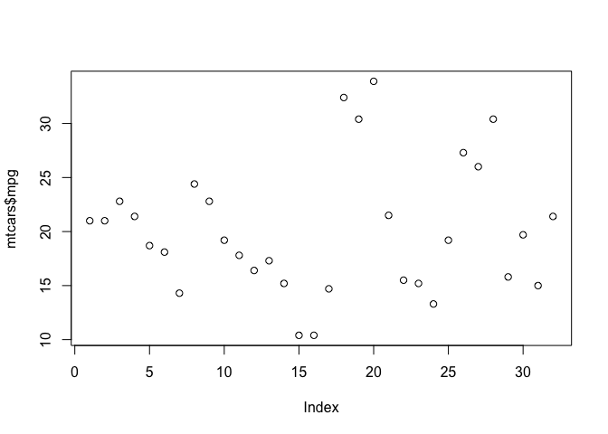

# Advanced Features
Jane Doe, John Smith
2025-11-24

# Advanced Features

This post demonstrates some advanced features of the Astro + Quarto
integration.

## Multiple Authors

Notice this post has multiple authors, which is automatically handled by
the loader.

## Field Mapping

The loader automatically maps Quarto fields to Astro conventions:

- `date` → `pubDate`
- `date-modified` → `updatedDate`
- `image` → `heroImage`

## Code Examples

``` python
def hello_world():
    print("Hello from Quarto!")
```

## Math Support

When rendered by Quarto, you can include mathematical notation:

$$
E = mc^2
$$

## Callouts

> [!NOTE]
>
> This is a Quarto callout block that will be rendered when you run
> `quarto render`.

``` r
library(tidyverse)
```

    ── Attaching core tidyverse packages ──────────────────────── tidyverse 2.0.0 ──
    ✔ dplyr     1.1.4     ✔ readr     2.1.6
    ✔ forcats   1.0.1     ✔ stringr   1.6.0
    ✔ ggplot2   4.0.1     ✔ tibble    3.3.0
    ✔ lubridate 1.9.4     ✔ tidyr     1.3.1
    ✔ purrr     1.2.0     
    ── Conflicts ────────────────────────────────────────── tidyverse_conflicts() ──
    ✖ dplyr::filter() masks stats::filter()
    ✖ dplyr::lag()    masks stats::lag()
    ℹ Use the conflicted package (<http://conflicted.r-lib.org/>) to force all conflicts to become errors

``` r
plot(mtcars$mpg)
```


